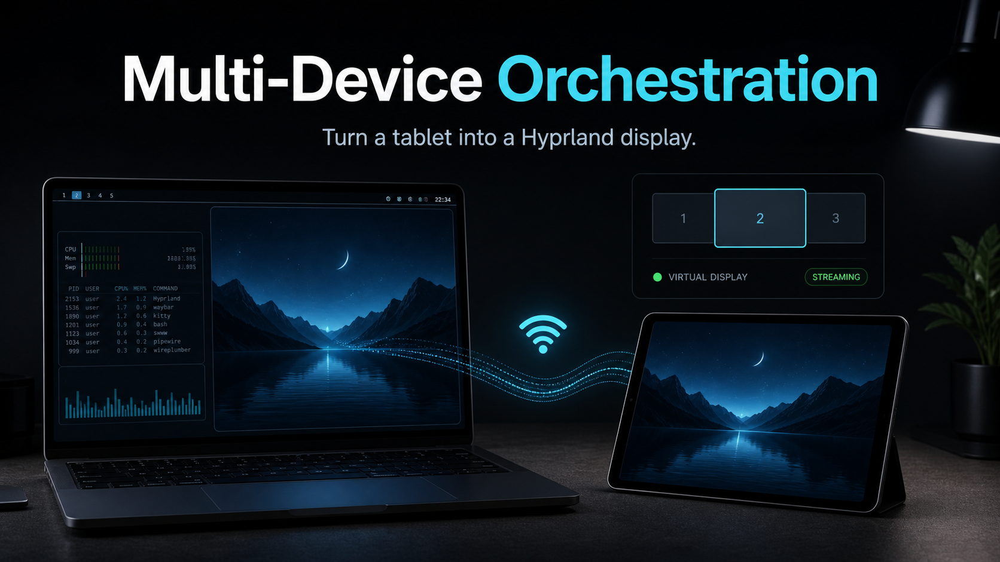

# Multi-Device Orchestration

<p align="center">
  
</p>

<p align="center">
  <strong>Turn a tablet browser into a secondary Hyprland display.</strong>
</p>

<p align="center">
  
  
  
  
</p>

## What It Does

This project creates a virtual Hyprland output and serves it to another device over the local network. Open the server URL on a tablet, phone, or second laptop and it becomes a lightweight secondary display viewer.

The current implementation is intentionally simple:

- `grim` captures the selected Hyprland output.
- Rust/Axum serves the latest frame as `/frame.jpg`.
- The browser client refreshes frames and shows a live FPS counter.
- Setup scripts create/configure a `TABLET-1` headless output.

It is a practical multi-device workflow prototype, not a production WebRTC stack yet.

## Included

```text
src/main.rs              Axum HTTP server
src/capture.rs           Hyprland/grim frame capture and JPEG resize
static/index.html        tablet browser viewer
scripts/setup-hyprland.sh
scripts/start-server.sh
.env.example             local output/resolution settings
```

## Requirements

- Linux desktop running Hyprland.
- Rust toolchain.
- `grim` for Wayland output capture.
- Tablet or phone on the same network.

Arch packages:

```bash
sudo pacman -S rust grim
```

## Quick Start

Clone and build:

```bash
git clone https://github.com/dakshdoesdev/Multi-Device-Orchestration.git
cd Multi-Device-Orchestration
cargo build --release
```

Create local config:

```bash
cp .env.example .env
```

Create the Hyprland virtual display:

```bash
./scripts/setup-hyprland.sh
```

Start the server:

```bash
./scripts/start-server.sh
```

Open the printed network URL on your tablet, usually:

```text
http://YOUR_LAPTOP_IP:8080
```

## Manual Run

If the virtual output already exists:

```bash
TABLET_OUTPUT=TABLET-1 cargo run --release
```

Health check:

```bash
curl http://localhost:8080/status
```

Frame endpoint:

```bash
curl -o frame.jpg http://localhost:8080/frame.jpg
```

## Current Limits

- The current stream is JPEG frame polling, not true WebRTC video.
- Touch input relay is not implemented.
- Hardware video encoding is not wired into the active path.
- Performance depends on Wi-Fi, capture cost, and target resolution.

The unused WebRTC/signaling modules are kept as a direction for the next version, but the shipped demo path is the simpler browser frame viewer.

## Verification

```bash
cargo check
bash -n scripts/*.sh
```

Latest local check:

```text
cargo check passed
```
